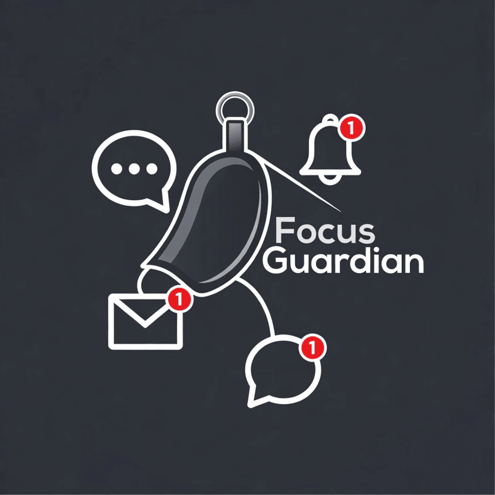

<div align="center">
  
  <h1>Focus Guardian</h1>
  <p><strong>Plan. Protect. Execute.</strong></p>
  <p>AI-powered iOS productivity app that helps you manage time, focus sessions, relationships, and goals — all from a unified timeline.</p>

  <a href="https://apps.apple.com/app/focusguardian">
    
  </a>
</div>

---

## What is Focus Guardian?

Focus Guardian is a productivity companion that goes beyond simple timers. It combines **smart scheduling**, **deep focus protection**, and a **character-driven AI buddy** that grows with your productivity — so you never miss what matters.

Built natively for iOS 17+ with SwiftUI, SwiftData, and StoreKit 2. No third-party dependencies.

---

## Features

### Free

| Feature | Description |
|---------|-------------|
| **Focus Buddy** | A character-driven feedback system that reacts to your productivity. Keep your buddy energized by completing sessions. |
| **Unified Calendar** | Read and write calendar events. See tasks, meetings, occasions, and travel in one timeline. |
| **Daily Insights** | Track your daily focus streaks, session completions, and buddy state in a beautiful card. |
| **Account Profile** | Personalize your experience with custom usernames and profile photos. |
| **Later List** | Capture ideas, links, and items via the Share Extension to schedule later. |
| **Live Activities** | See your active focus timer on the Lock Screen and Dynamic Island. |
| **Widget Support** | Home screen widgets showing your upcoming events and focus status. |

### Premium — $10.00/month or $59.99/year

| Feature | Description |
|---------|-------------|
| **Unlimited Focus Sessions** | No daily limit. Focus as much as you need. |
| **Guardian Smart Scheduler** | AI-powered day planning that organizes your tasks, meetings, and breaks intelligently. |
| **AI Task Planning** | Natural language input — tell Guardian what you need to do and it creates a structured plan. |
| **Advanced Analytics** | Complete weekly and monthly productivity trends, historical patterns, and performance rewards. |
| **Relationship Management** | Full people tracking — link contacts, manage occasions, and never forget what matters. |
| **AI Greeting Cards** | Auto-generated, emotionally balanced greeting cards for birthdays and anniversaries. |
| **Smart Occasion Reminders** | Intelligent reminders that prompt you to prepare cards and gifts before occasions. |

### 7-Day Free Trial

Every new user gets **full access to all Premium features for 7 days**. No credit card required upfront. After the trial, you keep the free features and can upgrade anytime.

---

## Tech Stack

| Layer | Technology |
|-------|-----------|
| **UI** | SwiftUI with glassmorphic design system |
| **Data** | SwiftData (on-device, privacy-first) |
| **Architecture** | MVVM + Singleton Services (@MainActor) |
| **Subscriptions** | StoreKit 2 (async/await) |
| **AI** | Google Gemini API / Apple Intelligence |
| **Calendar** | EventKit (iOS Calendar integration) |
| **Notifications** | UNUserNotificationCenter + Live Activities |
| **Extensions** | Share Extension, Widgets, Shortcuts |

---

## Website

This repository contains the **Focus Guardian landing page** — a high-conversion, Apple-inspired marketing site.

### Stack

- **React 19** + TypeScript
- **Vite** for dev/build
- **React Router** for `/privacy` and `/terms` pages
- Tailwind CSS utility classes
- No backend — fully static

### Pages

| Route | Component | Purpose |
|-------|-----------|---------|
| `/` | `HomePage` | Landing page with hero, features narrative, comparison, FAQ, CTA |
| `/privacy` | `PrivacyPolicy` | Apple-compliant Privacy Policy (required for App Store) |
| `/terms` | `TermsOfService` | Apple-compliant Terms of Service with subscription details |

### Run Locally

```bash
# Prerequisites: Node.js 18+

# 1. Install dependencies
npm install

# 2. Set your Gemini API key (for any AI-powered components)
cp .env.example .env.local
# Edit .env.local with your GEMINI_API_KEY

# 3. Start dev server
npm run dev

# 4. Build for production
npm run build
```

---

## App Architecture

```
FocusGuardian iOS App
├── Views (SwiftUI)
│   ├── Dashboard        — Home with Focus Buddy + productivity overview
│   ├── Analytics        — Weekly/Monthly trends & historical performance
│   ├── Calendar         — Unified timeline + event creation
│   ├── Focus            — Timer UI + Focus mode integration
│   └── Profile          — Account settings, subscription, preferences
│
├── Services (Singletons, @MainActor)
│   ├── GuardianCore         — Central AI orchestrator
│   ├── FocusBuddyAnalytics  — Stats aggregation & streak tracking
│   ├── SubscriptionService  — StoreKit 2 purchases + feature gates
│   ├── FocusModeService     — Timer + iOS Focus shortcuts
│   └── 40+ more services
│
├── Models (SwiftData)
│   ├── FocusBuddyDailyStats — Persistent productivity history
│   ├── CalendarEvent        — Unified event model (.task, .meeting, .occasion, .travel)
│   ├── FocusSession         — Timer session records
│   ├── UserProfile          — User identity & profile data
│   └── 26 more models
│
└── Subscription (StoreKit 2)
    ├── SubscriptionTypes    — Tiers, features, product IDs
    ├── SubscriptionService  — Purchase, restore, entitlements
    ├── PaywallView          — Glassmorphic paywall with plan comparison
    └── PremiumBadgeView     — Lock badges + feature gate modifiers
```

---

## Subscription Model

| | Free | Premium |
|---|---|---|
| **Price** | $0 | $10.00/mo or $59.99/yr |
| **Trial** | — | 7 days free |
| Focus Sessions | 3/day | Unlimited |
| Calendar | Read & Write | Read & Write |
| iOS Calendar Sync | Yes | Yes |
| Focus Buddy Insights | Daily Only | Weekly & Monthly |
| Guardian AI Scheduler | No | Yes |
| AI Task Planning | No | Yes |
| AI Greeting Cards | No | Yes |
| Relationship Management | No | Yes |

---

## Legal

- [Privacy Policy](https://focusguardian.app/privacy)
- [Terms of Service](https://focusguardian.app/terms)

---

## Contact

Questions, feedback, or support: **rakeshgeddam2025@gmail.com**

---

<div align="center">
  <sub>Built with SwiftUI, SwiftData, and StoreKit 2. No third-party dependencies.</sub>
</div>
